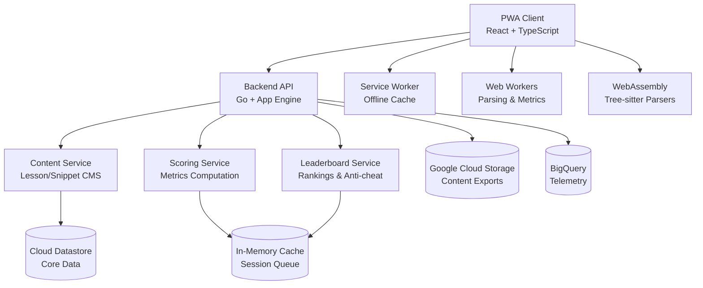

# Design Document

## Overview

The Typing Master for Coding is designed as a desktop-first, web-enabled Progressive Web Application (PWA) that provides syntax-aware typing practice across multiple programming languages. The system uses a modern client-server architecture with offline-first capabilities, real-time parsing, and comprehensive metrics tracking.

## Architecture

### High-Level Architecture

The system follows a distributed microservices architecture with clear separation of concerns:



### Client Architecture

**Frontend Stack:**
- **Framework**: React with TypeScript for type safety and component reusability
- **State Management**: Zustand/Redux for global state management
- **Code Editor**: Monaco Editor or CodeMirror 6 with read-only target text and custom overlay for typing interface
- **Styling**: Tailwind CSS for consistent, responsive design
- **PWA**: Service Worker with Workbox for offline caching and background sync

**Client Components:**
- **Parsing Engine**: Tree-sitter WASM parsers for C++, Rust, Python, JavaScript; YAML parser for validation
- **Metrics Engine**: Real-time keystroke analysis and scoring computation
- **Session Manager**: Handles practice sessions, event batching, and offline synchronization
- **UI Components**: Reusable components for different practice modes and interfaces

### Backend Architecture

**Backend Stack:**
- **Language**: Go for high performance and concurrent request handling
- **Platform**: Google Cloud App Engine Standard for automatic scaling and deployment
- **Framework**: Gin/Fiber for HTTP routing and middleware
- **Database**: Google Cloud Datastore for NoSQL document storage
- **Caching**: In-memory caching with sync.Map and TTL management
- **Authentication**: JWT tokens with short-lived access tokens
- **Monitoring**: Google Cloud Operations (formerly Stackdriver) for logging and monitoring

**Microservices:**
1. **API Gateway**: Routes requests, handles authentication, rate limiting
2. **Content Service**: Manages lessons, snippets, playlists with versioning
3. **Scoring Service**: Processes keystroke events and computes metrics
4. **Leaderboard Service**: Maintains rankings with time-windowed updates
5. **User Service**: Handles user profiles, preferences, and privacy settings

## Components and Interfaces

### Core Components

#### 1. Typing Engine
**Responsibility**: Real-time keystroke processing and validation
**Key Features**:
- Token-level comparison using language grammars
- AST shape matching for structural validation
- Whitespace policy enforcement per language
- Real-time error detection and correction tracking

```typescript
interface TypingEngine {
  processKeystroke(event: KeystrokeEvent): ValidationResult;
  validateSyntax(input: string, expected: string): SyntaxValidation;
  computeMetrics(session: TypingSession): SessionMetrics;
}
```

#### 2. Parser Manager
**Responsibility**: Language-specific parsing and tokenization
**Key Features**:
- Tree-sitter grammar integration
- Lazy loading of language parsers
- AST comparison and structural validation
- Error recovery and partial parsing

```typescript
interface ParserManager {
  loadParser(language: Language): Promise<Parser>;
  tokenize(code: string, language: Language): Token[];
  parseAST(code: string, language: Language): ASTNode;
  compareStructure(expected: ASTNode, actual: ASTNode): StructuralDiff;
}
```

#### 3. Metrics Calculator
**Responsibility**: Performance metrics computation and analysis
**Key Features**:
- Real-time CPM, tWPM, KPS calculation
- Accuracy metrics (raw, token, syntax)
- Error pattern analysis and clustering
- Composite score computation with configurable weights

```typescript
interface MetricsCalculator {
  calculateSpeed(events: KeystrokeEvent[]): SpeedMetrics;
  calculateAccuracy(input: string, expected: string): AccuracyMetrics;
  analyzeErrors(events: KeystrokeEvent[]): ErrorAnalysis;
  computeCompositeScore(metrics: AllMetrics): number;
}
```

#### 4. Session Manager
**Responsibility**: Practice session lifecycle management
**Key Features**:
- Session creation and state management
- Event batching and offline queuing
- Progress tracking and persistence
- Mode-specific session handling

```typescript
interface SessionManager {
  createSession(config: SessionConfig): TypingSession;
  recordEvent(sessionId: string, event: KeystrokeEvent): void;
  finalizeSession(sessionId: string): SessionResult;
  syncOfflineSessions(): Promise<void>;
}
```

### UI Components

#### 1. Practice Modes
- **Tutorial Mode**: Split-view with reference code and typing pane
- **Drill Mode**: Timer HUD with progress indicators and error markers
- **Zen Mode**: Minimal interface with optional ambient features
- **Assessment Mode**: Standardized testing interface with progress tracking

#### 2. Results and Analytics
- **Scoreboard**: Comprehensive results display with visual metrics
- **Progress Charts**: Historical performance trends and insights
- **Error Analysis**: Heatmaps and hotspot identification
- **Leaderboards**: Ranking displays with filtering and anti-cheat indicators

## Data Models

### Core Entities

#### User Entity (Datastore Kind: "User")
```go
type User struct {
    ID             string            `datastore:"-" json:"id"`
    Handle         string            `datastore:"handle" json:"handle"`
    Email          string            `datastore:"email" json:"email"`
    Locale         string            `datastore:"locale" json:"locale"`
    KeyboardLayout string            `datastore:"keyboard_layout" json:"keyboard_layout"`
    PrivacyMode    bool              `datastore:"privacy_mode" json:"privacy_mode"`
    Settings       map[string]interface{} `datastore:"settings" json:"settings"`
    CreatedAt      time.Time         `datastore:"created_at" json:"created_at"`
    UpdatedAt      time.Time         `datastore:"updated_at" json:"updated_at"`
}
```

#### Session Entity (Datastore Kind: "Session")
```go
type Session struct {
    ID         string            `datastore:"-" json:"id"`
    UserID     string            `datastore:"user_id" json:"user_id"`
    Mode       string            `datastore:"mode" json:"mode"`
    LanguageID string            `datastore:"language_id" json:"language_id"`
    LessonID   string            `datastore:"lesson_id" json:"lesson_id"`
    SnippetID  string            `datastore:"snippet_id" json:"snippet_id"`
    StartedAt  time.Time         `datastore:"started_at" json:"started_at"`
    EndedAt    *time.Time        `datastore:"ended_at" json:"ended_at"`
    DurationMs int64             `datastore:"duration_ms" json:"duration_ms"`
    Settings   map[string]interface{} `datastore:"settings" json:"settings"`
    CreatedAt  time.Time         `datastore:"created_at" json:"created_at"`
}
```

#### Session Events Entity (Datastore Kind: "SessionEvent")
```go
type SessionEvent struct {
    ID             string            `datastore:"-" json:"id"`
    SessionID      string            `datastore:"session_id" json:"session_id"`
    TimestampMs    int64             `datastore:"timestamp_ms" json:"timestamp_ms"`
    KeyPressed     string            `datastore:"key_pressed" json:"key_pressed"`
    Action         string            `datastore:"action" json:"action"` // 'down', 'up'
    CursorPosition int               `datastore:"cursor_position" json:"cursor_position"`
    ErrorFlag      bool              `datastore:"error_flag" json:"error_flag"`
    ExpectedToken  string            `datastore:"expected_token" json:"expected_token"`
    Metadata       map[string]interface{} `datastore:"metadata" json:"metadata"`
    CreatedAt      time.Time         `datastore:"created_at" json:"created_at"`
}
```

#### Results Entity (Datastore Kind: "Result")
```go
type Result struct {
    SessionID       string            `datastore:"-" json:"session_id"`
    CPM             float64           `datastore:"cpm" json:"cpm"`
    TWPM            float64           `datastore:"twpm" json:"twpm"`
    RawAccuracy     float64           `datastore:"raw_accuracy" json:"raw_accuracy"`
    TokenAccuracy   float64           `datastore:"token_accuracy" json:"token_accuracy"`
    SyntaxAccuracy  float64           `datastore:"syntax_accuracy" json:"syntax_accuracy"`
    BackspaceRate   float64           `datastore:"backspace_rate" json:"backspace_rate"`
    CompositeScore  int               `datastore:"composite_score" json:"composite_score"`
    Breakdown       map[string]interface{} `datastore:"breakdown" json:"breakdown"`
    CreatedAt       time.Time         `datastore:"created_at" json:"created_at"`
}
```

### Content Models

#### Language Entity (Datastore Kind: "Language")
```go
type Language struct {
    ID              string            `datastore:"-" json:"id"`
    Name            string            `datastore:"name" json:"name"`
    Version         string            `datastore:"version" json:"version"`
    ParserID        string            `datastore:"parser_id" json:"parser_id"`
    GrammarConfig   map[string]interface{} `datastore:"grammar_config" json:"grammar_config"`
    WhitespaceRules map[string]interface{} `datastore:"whitespace_rules" json:"whitespace_rules"`
    CreatedAt       time.Time         `datastore:"created_at" json:"created_at"`
}
```

#### Lesson Entity (Datastore Kind: "Lesson")
```go
type Lesson struct {
    ID               string            `datastore:"-" json:"id"`
    LanguageID       string            `datastore:"language_id" json:"language_id"`
    Title            string            `datastore:"title" json:"title"`
    Difficulty       int               `datastore:"difficulty" json:"difficulty"`
    Objectives       []string          `datastore:"objectives" json:"objectives"`
    Prerequisites    []string          `datastore:"prerequisites" json:"prerequisites"`
    EstimatedMinutes int               `datastore:"estimated_minutes" json:"estimated_minutes"`
    TokensCovered    []string          `datastore:"tokens_covered" json:"tokens_covered"`
    SnippetIDs       []string          `datastore:"snippet_ids" json:"snippet_ids"`
    Version          int               `datastore:"version" json:"version"`
    CreatedAt        time.Time         `datastore:"created_at" json:"created_at"`
}
```

#### Snippet Entity (Datastore Kind: "Snippet")
```go
type Snippet struct {
    ID                string            `datastore:"-" json:"id"`
    LanguageID        string            `datastore:"language_id" json:"language_id"`
    Title             string            `datastore:"title" json:"title"`
    SourceCode        string            `datastore:"source_code,noindex" json:"source_code"`
    Tags              []string          `datastore:"tags" json:"tags"`
    Difficulty        int               `datastore:"difficulty" json:"difficulty"`
    EstimatedTime     int               `datastore:"estimated_time" json:"estimated_time"`
    Checksum          string            `datastore:"checksum" json:"checksum"`
    AccessibilityTags map[string]interface{} `datastore:"accessibility_tags" json:"accessibility_tags"`
    CreatedAt         time.Time         `datastore:"created_at" json:"created_at"`
}
```

## Error Handling

### Client-Side Error Handling
- **Parsing Errors**: Graceful fallback to line-diff comparison for large snippets
- **Network Errors**: Offline queue with automatic retry and exponential backoff
- **Validation Errors**: Real-time user feedback with correction suggestions
- **Performance Issues**: Web Worker isolation prevents UI blocking

### Server-Side Error Handling
- **Rate Limiting**: Token bucket algorithm with user-specific limits
- **Data Validation**: Input sanitization and schema validation
- **Service Failures**: Circuit breaker pattern with graceful degradation
- **Anti-Cheat**: Anomaly detection with configurable thresholds

## Testing Strategy

### Unit Testing
- **Parsing Logic**: Property-based testing with random code generators
- **Metrics Calculation**: Precision testing for scoring algorithms
- **Event Processing**: State machine validation for session lifecycle
- **UI Components**: React Testing Library for component behavior

### Integration Testing
- **Session Pipeline**: End-to-end session creation → scoring → leaderboard flow
- **Offline Sync**: Service Worker cache validation and sync testing
- **Parser Integration**: Tree-sitter grammar accuracy across languages
- **API Contracts**: gRPC/REST endpoint validation

### End-to-End Testing
- **User Journeys**: Playwright/Cypress automation for complete workflows
- **Performance Testing**: Load testing for 500 events/sec/user, 5k concurrent users
- **Accessibility Testing**: axe-core audits and keyboard navigation validation
- **Cross-Browser Testing**: Compatibility across modern browsers

### Security Testing
- **Authentication**: JWT token validation and expiration testing
- **Input Validation**: SQL injection and XSS prevention
- **Privacy**: GDPR compliance and data anonymization verification
- **Anti-Cheat**: False positive/negative rate optimization

## Performance Considerations

### Client Performance
- **Keystroke Latency**: Target <8ms response time for typing feedback
- **Parsing Performance**: Web Worker isolation with WASM optimization
- **Memory Management**: Efficient event batching and garbage collection
- **Bundle Size**: Code splitting and lazy loading for language parsers

### Server Performance
- **Concurrent Users**: App Engine automatic scaling with stateless services
- **Database Optimization**: Datastore composite indexes and query optimization
- **Caching Strategy**: In-memory caching with TTL for session state and leaderboard data
- **CDN Integration**: Google Cloud CDN for static asset delivery and global distribution

### Offline Performance
- **Cache Strategy**: Workbox precaching for critical resources
- **Sync Optimization**: Batched uploads with compression
- **Storage Management**: IndexedDB for large offline datasets
- **Background Processing**: Service Worker for non-blocking operations

## Security Architecture

### Authentication & Authorization
- **JWT Tokens**: Short-lived access tokens with refresh token rotation
- **Anonymous Mode**: Device-local storage without server authentication
- **Privacy Controls**: Granular consent management for data collection
- **CSRF Protection**: SameSite cookies and CSRF tokens

### Data Protection
- **Encryption**: TLS 1.3 for all client-server communication
- **Data Minimization**: Event-level filtering to reduce stored data
- **Anonymization**: Configurable PII removal for telemetry
- **GDPR Compliance**: Right to deletion and data portability

### Anti-Cheat Measures
- **Behavioral Analysis**: Statistical anomaly detection for typing patterns
- **Client Validation**: Multiple validation layers with server verification
- **Session Integrity**: Tamper detection for session events
- **Tournament Mode**: Optional enhanced verification for competitions

## Google Cloud Platform Integration

### App Engine Configuration
- **Runtime**: Go 1.21+ on App Engine Standard Environment
- **Scaling**: Automatic scaling with configurable min/max instances
- **Environment Variables**: Secure configuration management for API keys and settings
- **Health Checks**: Built-in health monitoring and automatic restarts

### Datastore Implementation
- **Entity Design**: Optimized for query patterns with composite indexes
- **Consistency**: Strong consistency for user data, eventual consistency for analytics
- **Transactions**: Entity groups for related data consistency
- **Backup**: Automated daily backups with point-in-time recovery

### Caching Strategy
- **In-Memory Cache**: Go sync.Map with TTL management for session data
- **Cache Patterns**: Write-through for user preferences, write-behind for metrics
- **Cache Invalidation**: Event-driven invalidation for real-time updates
- **Memory Management**: Configurable cache size limits and LRU eviction

### Monitoring and Operations
- **Cloud Operations**: Integrated logging, monitoring, and alerting
- **Error Reporting**: Automatic error tracking and notification
- **Performance Monitoring**: Request latency and throughput metrics
- **Custom Metrics**: Business metrics for user engagement and system health